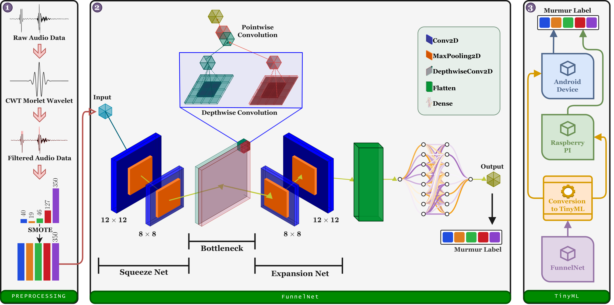

# FunnelNet
Codebase of our paper "FunnelNet: An End-to-End Deep Learning Framework to Monitor Digital Heart Murmur in Real-Time".

# Abstract

**Objective:** Heart murmurs are abnormal sounds caused by turbulent blood flow within the heart. Several diagnostic methods are available to detect heart murmurs and their severity, such as cardiac auscultation, echocardiography, phonocardiogram (PCG), etc. However, these methods have limitations, including extensive training and experience among healthcare providers, cost and accessibility of echocardiography, as well as noise interference and PCG data processing. This study aims to develop a novel end-to-end real-time heart murmur detection approach using traditional and depthwise separable convolutional networks. **Methods:** Continuous wavelet transform (CWT) was applied to extract meaningful features from the PCG data. The proposed network has three parts: the Squeeze net, the Bottleneck, and the Expansion net. The Squeeze net generates a compressed data representation, whereas the Bottleneck layer reduces computational complexity using a depthwise-separable convolutional network. The Expansion net is responsible for up-sampling the compressed data to a higher dimension, capturing tiny details of the representative data. **Results:** For evaluation, we used four publicly available datasets and achieved state-of-the-art performance in all datasets. Furthermore, we tested our proposed network on two resource-constrained devices: a Raspberry PI and an Android device, stripping it down into a tiny machine learning model (TinyML), achieving a maximum of 99.70%. **Conclusion:** The proposed model offers a deep learning framework for real-time accurate heart murmur detection within limited resources. **Significance:** It will significantly result in more accessible and practical medical services and reduced diagnosis time to assist medical professionals. The code is publicly available at TBA.

# Overview

*Fig: An illustration of the proposed FunnelNet network architecture, divided into three parts: the squeeze net, the bottleneck, and the expansion net. The Squeeze net and the Expansion net work like an encoder and decoder to compress and upscale the most relevant input features. A depthwise CNN has been employed at the Bottleneck for reduced computational complexity. A fully connected layer is placed at the end to predict the correct class.*

# Folder Structure

The whole project is comprised of four main parts:

1. Code of the proposed architecture
2. Android application code
3. Server-side API
4. Inferencing code of Raspberry PI

#### 1. Proposed Architecture

This portion comprises the directory `kode` and the files `eda.ipynb`, `perf.ipynb`, and `train.py`.

#### 2. Android Application Code

The `android-src` directory contains the code of the developed Android application

#### 3. Server-side API

The code of the server-side API resides in the `fastapi-server` directory along with the `requirements.txt` file.

#### 4. Raspberry PI Inferencing Code

`rpi_inference.py` file contains the necessary code to make an inference of a heart sound sample.

